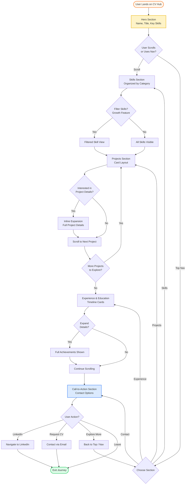
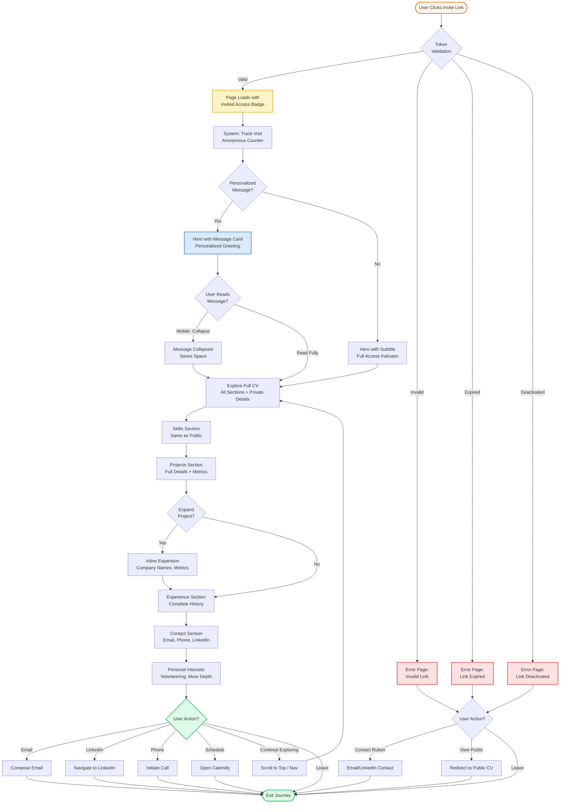
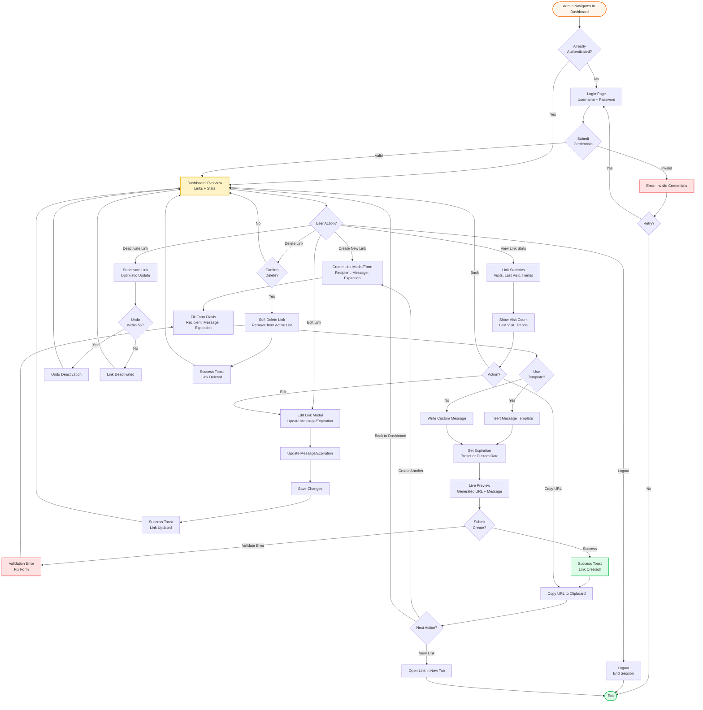
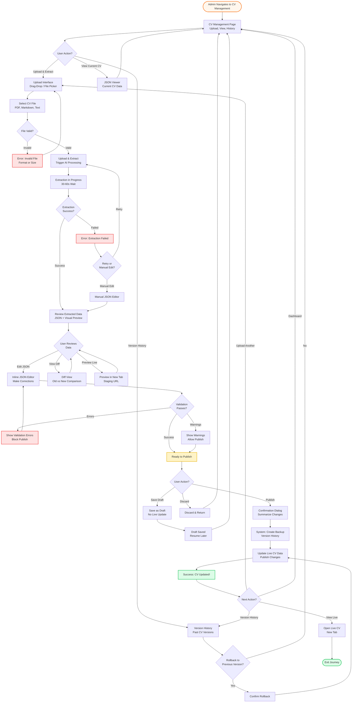

# cv-hub User Journey Flow Proposals

**Generated:** 2025-11-04
**Status:** Draft for discussion
**Design Direction:** Professional Modern (Single-column, card-based, top nav, progressive disclosure)

---

## Journey 1: Public CV Exploration

### Goal
Anonymous visitor wants to **quickly understand Ruben's skills, experience, and projects** to assess professional fit without commitment or providing personal information.

### Entry Point
- **URL:** `https://cv-hub.example.com/`
- **Context:** Found via LinkedIn profile link, Google search, word-of-mouth recommendation, or social media
- **User State:** Anonymous, no authentication required
- **Device:** Desktop (primary), Mobile (secondary)

### Flow Steps

#### Step 1: Landing / Hero Section (Above the Fold)

**User sees:**
- Large, bold heading: Name + Professional Title (e.g., "Ruben — Senior Full-Stack Engineer")
- Brief tagline/elevator pitch (1-2 sentences)
- Key skills visualization: 6-8 primary skills as prominent tags/badges (orange accents)
- Professional photo or avatar (optional, depending on preference)
- Scroll indicator or subtle animation suggesting more content below

**User can:**
- Scroll down to explore sections
- Click top navigation to jump to specific section
- Read the hero content to get immediate professional context

**System provides:**
- Instant visual impression (<3s FCP)
- Clear value proposition above the fold
- Visual hierarchy: Name/Title → Tagline → Key Skills
- Smooth scroll indicator inviting exploration

**Mobile differences:**
- Stacked layout (no side-by-side)
- Hamburger menu for navigation
- Slightly smaller font sizes, but hierarchy maintained

---

#### Step 2: Skills Section Discovery

**User sees:**
- Section heading: "Skills & Expertise" with subtle orange underline
- Skills organized by category (e.g., Frontend, Backend, DevOps, Tools)
- Visual tags/badges with appropriate colors (monochrome base + orange for primary)
- Optional: Proficiency indicators or years of experience (subtle)

**User can:**
- Scan skills quickly (visual, not text-heavy)
- Filter by category using client-side toggle buttons (optional)
- Hover over skill tags to see additional context (tooltip)

**System provides:**
- Instant filtering without page reload (if filter enabled)
- Smooth transitions when toggling categories
- Visual grouping for quick scanning

**Mobile differences:**
- Skills wrap naturally on smaller screens
- Filter buttons stack or use horizontal scroll
- Touch-optimized tap targets (44x44px minimum)

---

#### Step 3: Projects Exploration

**User sees:**
- Section heading: "Featured Projects"
- Card layout: 2-3 projects visible initially (depending on screen width)
- Each card shows:
  - Project title (bold, semibold)
  - Brief description (2-3 lines)
  - Tech stack tags (subtle, smaller badges)
  - "Show More" button or expandable indicator
  - Optional: Project thumbnail/icon

**User can:**
- Scroll through project cards
- Click "Show More" to expand project details inline
- Click tech stack tags to see related projects (optional)

**System provides:**
- Inline expansion: Details slide down smoothly within the card
- Expanded state shows:
  - Full project description
  - Key achievements/outcomes
  - Tech stack details
  - Timeline
  - "Show Less" button to collapse
- No modal interruption (stays in flow)
- Smooth animations (0.2-0.3s ease)

**Mobile differences:**
- Single column layout
- Cards stack vertically
- Full width for better readability
- Expansion animation optimized for mobile

---

#### Step 4: Experience & Education Navigation

**User sees:**
- "Work Experience" section: Timeline-style cards
- Each card shows:
  - Job title (bold)
  - Company name (secondary text, potentially reduced for public view)
  - Date range
  - Key highlights (bullet points, 3-5 items)
  - Expandable "More Details" option
- "Education" section: Similar card structure with degrees, institutions, dates

**User can:**
- Scroll through chronological timeline
- Expand experience cards to see full achievements
- Navigate to next section via top nav or scroll

**System provides:**
- Clear visual timeline (subtle left border or connecting lines)
- Expandable details for deep-dive when interested
- Scannable highlights for quick assessment
- Progressive disclosure: Essential info → Full details on demand

**Mobile differences:**
- Timeline indicators simplified or removed
- Cards take full width
- Expansion happens in-place (no side-by-side)

---

#### Step 5: Call-to-Action Discovery

**User sees:**
- Subtle CTA section near bottom: "Interested in working together?"
- Message indicating limited contact info on public view
- Suggestion: "Contact me via LinkedIn" or "Request full CV via email"
- LinkedIn button/link (primary action)

**User can:**
- Click LinkedIn button to connect
- See that full contact details are not publicly available (trust signal)
- Understand that personalized access is available upon request

**System provides:**
- Clear but non-pushy CTA
- Respects privacy-first approach (no email/phone on public page)
- Professional call-to-action without being salesy

**Mobile differences:**
- CTA section stacks vertically
- Buttons take full width or center-aligned
- Fixed bottom CTA bar (optional decision point below)

---

### Decision Points

#### Decision Point 1: Navigation Style

**Question:** How should users navigate between CV sections?

**Option A: Free Scroll with Sticky Section Nav**
- **Pros:**
  - Natural browsing experience
  - User controls pace
  - Sticky nav provides quick jumps
  - Best for storytelling flow
- **Cons:**
  - Requires more scrolling for impatient users
  - Mobile needs careful sticky nav design
- **Best for:** Users who want to understand the full picture

**Option B: Section Tabs (Top-Level)**
- **Pros:**
  - Direct access to any section
  - Clear separation of content
  - Easy to understand structure
- **Cons:**
  - Less narrative flow
  - Can feel fragmented
  - Mobile tabs need horizontal scroll or menu
- **Best for:** Users who know what they're looking for

**Option C: Hybrid - Free Scroll + Sticky Jump-to-Section**
- **Pros:**
  - Combines natural flow with quick access
  - Best of both worlds
  - Works well on mobile with hamburger menu
- **Cons:**
  - Slightly more complex implementation
  - Requires careful UI design to avoid clutter
- **Best for:** All user types (flexible)

**Recommendation:** **Option C (Hybrid)** - Aligns with "Flexibility: Balanced Control" principle. Users can scroll naturally or jump directly. Sticky top nav on desktop, hamburger menu on mobile with section links.

---

#### Decision Point 2: Project Details Presentation

**Question:** How should users access detailed project information?

**Option A: Inline Expansion**
- **Pros:**
  - No context switching (stays in flow)
  - Progressive disclosure (core principle)
  - Smooth animations enhance quality feel
  - Works well on all devices
- **Cons:**
  - Long expanded cards might require scrolling
  - Multiple expansions can make page feel long
- **Best for:** Quick exploration without interruption

**Option B: Dedicated Project Pages**
- **Pros:**
  - Full space for rich project details
  - Can include more media (screenshots, videos)
  - Shareable URLs per project
- **Cons:**
  - Requires navigation away from main CV
  - More complex routing
  - Feels heavier for simple CV browsing
- **Best for:** Portfolio-heavy presentations

**Option C: Modal Dialog**
- **Pros:**
  - Clear focus on one project
  - Doesn't affect page scroll position
  - Easy to close and return
- **Cons:**
  - Interrupts flow (against core principles)
  - Can feel heavy/intrusive
  - Mobile modals can be awkward
- **Best for:** Image-heavy showcases

**Recommendation:** **Option A (Inline Expansion)** - Aligns perfectly with "Progressive Disclosure" and "Professional Modern" direction. Keeps users in flow, no modal interruption, works beautifully on mobile.

---

#### Decision Point 3: CTA Placement & Strategy

**Question:** Where and how should the primary call-to-action appear?

**Option A: Single Bottom CTA**
- **Pros:**
  - Clean, unobtrusive
  - Natural end of journey
  - Doesn't distract from content
- **Cons:**
  - Requires full scroll to reach
  - Easy to miss if user doesn't scroll all the way
- **Best for:** Users who consume all content

**Option B: Multiple CTAs Throughout**
- **Pros:**
  - Catches interest at any point
  - Reinforces contact option
  - Higher conversion potential
- **Cons:**
  - Can feel pushy/sales-y
  - Dilutes content focus
  - Against minimalist aesthetic
- **Best for:** Aggressive conversion goals

**Option C: Top Nav CTA + Bottom Section**
- **Pros:**
  - Always accessible (top nav)
  - Non-intrusive (just a nav item)
  - Reinforced at journey end (bottom section)
  - Professional balance
- **Cons:**
  - Requires two CTA implementations
- **Best for:** Balanced approach

**Option D: Sticky Bottom Bar (Mobile) + Bottom Section (Desktop)**
- **Pros:**
  - Mobile-optimized (always visible)
  - Desktop stays clean
  - Device-appropriate UX
- **Cons:**
  - Takes screen space on mobile
  - Inconsistent across devices
- **Best for:** Mobile-first conversion

**Recommendation:** **Option C (Top Nav + Bottom Section)** - "Contact" as top nav item (subtle orange on hover) + dedicated CTA section at bottom. Accessible without being pushy. Aligns with "Trust: Transparency" principle.

---

#### Decision Point 4: Skill Filtering UI

**Question:** Should skill filtering be included in MVP?

**Option A: No Filtering (MVP)**
- **Pros:**
  - Simpler implementation
  - Clean initial experience
  - All skills visible (comprehensive view)
- **Cons:**
  - Long skill lists can overwhelm
  - No quick way to focus on specific area
- **Best for:** Quick launch, simpler skill sets

**Option B: Category Tabs/Toggles**
- **Pros:**
  - Quick way to focus (Frontend/Backend/DevOps)
  - Client-side (no reload)
  - Enhances "Flexibility" principle
- **Cons:**
  - Adds UI complexity
  - Requires thoughtful category design
- **Best for:** Large skill sets, diverse expertise

**Option C: Search/Filter Input**
- **Pros:**
  - Maximum flexibility
  - Useful for very large skill lists
  - Power-user friendly
- **Cons:**
  - Potentially overengineered for CV
  - Not typical CV browsing pattern
- **Best for:** Extensive skill databases

**Recommendation:** **Option A for MVP, Option B as Growth Feature** - Keep MVP clean and launch faster. Add category filtering post-launch if skill list grows or user feedback suggests need.

---

### Error/Edge Cases

**Case 1: Slow Network / Poor Connection**
- **Scenario:** User on slow mobile network
- **Recovery:**
  - SSR ensures content visible immediately (HTML rendered)
  - Skeleton screens for interactive elements
  - Progressive enhancement: Basic content works without JS
  - No hydration delays block content

**Case 2: JavaScript Disabled**
- **Scenario:** User has JS disabled or blocked
- **Recovery:**
  - Full CV content still visible (SSR)
  - Filters don't work, but all content is visible
  - Expandable sections default to expanded state
  - Navigation works (anchor links)

**Case 3: Deep Link to Section**
- **Scenario:** User shares URL like `/#projects`
- **Recovery:**
  - Page scrolls to correct section on load
  - Smooth scroll animation
  - Section highlighted briefly (subtle)

**Case 4: Mobile Landscape Orientation**
- **Scenario:** User rotates phone to landscape
- **Recovery:**
  - Layout adapts (still single-column for readability)
  - Nav remains accessible
  - No horizontal scroll required

**Case 5: Very Large Screen (4K/Ultrawide)**
- **Scenario:** User on 2560px+ wide screen
- **Recovery:**
  - Max-width container (1024px) keeps content readable
  - Content centered
  - Background extends naturally
  - No awkward stretching

---

### Success State

**Journey completes successfully when:**
- User has clear understanding of skills and expertise
- User has seen 2-3 projects that demonstrate capabilities
- User has formed professional impression (positive)
- User knows how to get in touch (LinkedIn visible)

**Next Actions Available:**
1. **Connect on LinkedIn** (primary)
2. **Request personalized CV** (if interested in hiring)
3. **Explore more projects** (scroll/navigate)
4. **Share CV link** (copy URL)

**Emotional State:**
- "Impressed & Convinced" - This person is competent and professional
- "Comfortable & Oriented" - I understand what they do and how to reach them
- "Curious & Interested" - I want to learn more or potentially collaborate

---

### Mermaid Diagram

---

## Journey 2: Personalized Link Access

### Goal
Recruiter or Tech Lead with a personalized invite link wants to **view complete CV with full details, understand the personalized context, and easily get in touch**.

### Entry Point
- **URL:** `https://cv-hub.example.com/invite/{token}`
- **Context:** Received link via email, LinkedIn message, or direct communication from Ruben
- **User State:** Invited, token-authenticated (no login required)
- **Device:** Desktop (primary), Mobile (common for quick checks)
- **User Mindset:** More intentional than public visitor, expecting personalized content

### Flow Steps

#### Step 1: Token Validation & Landing

**User sees:**
- URL processes in background (token validation)
- If valid: Page loads with subtle indicator (badge top-right: "Invited Access" or "Personalized View")
- Hero section loads similarly to public view BUT with additional personalized message card (if provided)
- Professional, clean transition (no jarring "you're special" messaging)

**User can:**
- See immediate confirmation of personalized access (badge)
- Read personalized message (if provided by Ruben)
- Understand they have full CV access

**System provides:**
- **Valid Token:** Smooth page load with personalized content
- **Invalid/Expired Token:** Friendly error page (see Edge Case 1)
- Automatic tracking: Visit count incremented, last visit timestamp updated (anonymous)
- No intrusive authentication flow (token in URL is auth)

**Mobile differences:**
- Badge smaller but visible (top-right corner)
- Personalized message card may be collapsible to save space

---

#### Step 2: Personalized Message Presentation

**User sees (if message provided):**
- Hero section includes personalized message card
- Styled as elegant, prominent card (not a system notification)
- Visual treatment:
  - Subtle background color (orange-50 or zinc-50)
  - Clear typography hierarchy: "Hey [Name]," followed by message
  - Signed: "— Ruben" at bottom
  - Professional-warm tone

**User sees (if NO message provided):**
- Hero section with standard layout
- Subtitle: "You have full access to Ruben's complete profile"
- Badge indicator remains visible

**User can:**
- Read personalized context (why they received this link)
- Feel valued (personalized attention to detail)
- Understand the purpose of their access

**System provides:**
- Markdown rendering for message (if formatting used)
- Professional presentation (not like a mass email)
- Human touch that builds trust

**Mobile differences:**
- Message card may be collapsible ("Show Message" / "Hide Message")
- Collapsible state persists during session
- Still accessible but doesn't dominate mobile viewport

---

#### Step 3: Full CV Exploration with Enhanced Content

**User sees:**
- All sections from public view (Skills, Projects, Experience, Education)
- PLUS additional sections/details:
  - **Contact Information Section:** Email, Phone, LinkedIn, Location (city/country)
  - **Extended Project Details:** Company names (if redacted on public), metrics, private info
  - **Personal Interests/Volunteering:** More depth, shows personality
  - **References Available:** Indicator that references can be provided upon request
- Subtle visual cues: Some sections may have small "Full Access" badges (optional)

**User can:**
- Explore all CV content without restrictions
- Access complete professional history
- See contact details prominently
- Understand full scope of experience and skills

**System provides:**
- Same navigation as public view (consistency)
- Progressive disclosure still applies (expandable projects)
- No content gating or "unlock" prompts
- Smooth, professional experience

**Mobile differences:**
- Contact section may be sticky bottom bar with "Get in Touch" CTA
- All content accessible via scrolling
- No horizontal scroll required

---

#### Step 4: Contact & Call-to-Action

**User sees:**
- Dedicated "Contact" section (more prominent than public view)
- Multiple contact options:
  - Email (primary button)
  - LinkedIn (secondary button)
  - Phone (optional, depending on preference)
  - Calendly link (optional: "Schedule a call")
- Friendly invitation: "Let's connect" or "I'd love to hear from you"

**User can:**
- Click email to compose message (mailto: link)
- Navigate to LinkedIn profile
- Copy phone number (click-to-copy or tel: link)
- Schedule meeting directly (if Calendly enabled)

**System provides:**
- Clear, non-pushy CTAs
- Multiple contact options (user chooses preference)
- Professional tone (warm but not desperate)

**Mobile differences:**
- Sticky bottom CTA bar (optional): "Get in Touch" button
- Click opens bottom sheet with contact options
- Native mobile actions: tel: links, mailto: links work seamlessly

---

### Decision Points

#### Decision Point 1: Personalized Message Placement

**Question:** Where should the personalized message appear?

**Option A: Hero Integration (Above CV Content)**
- **Pros:**
  - Immediate visibility (above the fold)
  - Feels like personal letter
  - Clear context before exploring CV
  - Aligns with "Trust: Transparency" principle
- **Cons:**
  - Pushes CV content down slightly
  - Mobile requires careful space management
- **Best for:** Emphasizing personal touch

**Option B: Top Banner (Dismissible)**
- **Pros:**
  - Visible but not intrusive
  - User can dismiss to focus on CV
  - Saves vertical space
- **Cons:**
  - Feels like system notification (less personal)
  - Can be easily dismissed and forgotten
  - Banner patterns often feel generic
- **Best for:** Minimal disruption

**Option C: Modal on Entry**
- **Pros:**
  - Guaranteed to be seen
  - Full attention on message
  - Clear "enter CV" transition
- **Cons:**
  - Interrupts flow immediately
  - Feels intrusive (against core principles)
  - Modal patterns can be annoying
- **Best for:** Critical messages requiring acknowledgment

**Option D: Subtle Badge + Dedicated Message Section**
- **Pros:**
  - Doesn't disrupt hero
  - Message has its own section (second section after hero)
  - Badge keeps context visible
  - User scrolls to message naturally
- **Cons:**
  - Message might be missed if user doesn't scroll
  - Less immediate impact
- **Best for:** Non-critical messages

**Recommendation:** **Option A (Hero Integration)** - Message as elegant card within hero section, above main CV content. This aligns with the "Personalized Invite Experience" pattern from UX Design Spec. It's professional, immediate, and sets the right tone.

**Implementation Notes:**
- Desktop: Message card in hero, side-by-side or stacked with key skills
- Mobile: Message card collapsible to save space ("Show Message" toggle)

---

#### Decision Point 2: Visual Differentiation (Invited vs Public)

**Question:** How should invited view visually differ from public view?

**Option A: Same Design + More Content**
- **Pros:**
  - Consistency (same brand, same UX)
  - Natural feel (invited = "more of the same")
  - No jarring visual shift
  - Code reuse (maintainability)
- **Cons:**
  - Less obvious that it's special access
  - Might feel underwhelming ("is this different?")
- **Best for:** Subtle, trust-focused approach

**Option B: Subtle Theme Variation**
- **Pros:**
  - Clear indication of invited access
  - Special feel without being over-the-top
  - Could use slightly different orange shade or accent
- **Cons:**
  - More complex to maintain (two themes)
  - Risk of feeling "gimmicky"
  - Against minimalist principles
- **Best for:** Making invited access feel premium

**Option C: Badge/Indicator Only**
- **Pros:**
  - Minimal change, maximum clarity
  - Badge communicates "invited access"
  - Content differentiation is enough
- **Cons:**
  - Badge might be ignored or not noticed
  - No "special" visual feel
- **Best for:** Clean, no-nonsense approach

**Option D: Content Badges ("Full Access" on Sections)**
- **Pros:**
  - Clear which sections are invite-only
  - Educational (shows what public doesn't see)
  - Reinforces value of invite
- **Cons:**
  - Can feel like unlock prompts (against trust principle)
  - Adds visual clutter
  - Might feel salesy
- **Best for:** Emphasizing exclusive content

**Recommendation:** **Option A + Option C (Same Design + Badge)** - Keep design identical for consistency and trust. Use subtle "Invited Access" badge (top-right) to indicate special status. Content differentiation (additional sections, full details) is the real value, not visual gimmicks.

**Implementation Notes:**
- Badge: Subtle, non-intrusive (small size, zinc-400 border, minimal)
- Hero personalized message is the main visual differentiation
- Additional sections (Contact, full details) are clearly labeled

---

#### Decision Point 3: Contact CTA Strategy

**Question:** How should contact options be presented?

**Option A: Single Bottom CTA Section**
- **Pros:**
  - Clean, professional
  - Natural end of CV journey
  - All options in one place
- **Cons:**
  - Requires full scroll to reach
  - Mobile users might not scroll all the way
- **Best for:** Desktop-heavy audiences

**Option B: Multiple Contact Points Throughout**
- **Pros:**
  - Catches interest at any scroll depth
  - Reinforces contact options
  - Higher conversion potential
- **Cons:**
  - Can feel pushy
  - Dilutes content focus
  - Against minimalist aesthetic
- **Best for:** Aggressive conversion goals

**Option C: Sticky "Get in Touch" Button**
- **Pros:**
  - Always accessible (no scroll needed)
  - Mobile-friendly
  - High visibility without intrusion
- **Cons:**
  - Takes screen space (especially mobile)
  - Can feel salesy if too prominent
- **Best for:** Mobile-first conversion

**Option D: Top Nav "Contact" + Bottom Section**
- **Pros:**
  - Professional balance
  - Top nav subtle, bottom section comprehensive
  - Works across devices
  - Non-intrusive
- **Cons:**
  - Requires two implementations
- **Best for:** Balanced, trust-focused approach

**Option E: Top Nav + Sticky Bottom Bar (Mobile Only)**
- **Pros:**
  - Device-appropriate UX
  - Desktop stays clean
  - Mobile optimized for quick action
- **Cons:**
  - Inconsistent across devices
  - More complex implementation
- **Best for:** Mobile-heavy recruitment scenarios

**Recommendation:** **Option E (Top Nav + Sticky Mobile Bar)** - "Contact" in top nav (desktop/mobile), PLUS sticky bottom CTA bar on mobile only. This respects desktop cleanliness while optimizing for mobile quick-action scenarios (common in recruiting).

**Implementation Notes:**
- Desktop: "Contact" nav item (orange on hover) + comprehensive bottom section
- Mobile: Same as desktop + sticky bottom bar ("Get in Touch" button)
- Bottom bar opens bottom sheet with contact options (Email, LinkedIn, Phone, Calendly)

---

#### Decision Point 4: Token State Handling

**Question:** How should invalid/expired tokens be handled?

**Option A: Hard Fail - Error Page**
- **Pros:**
  - Clear, unambiguous
  - User knows immediately
  - No confusion about access
- **Cons:**
  - Dead end (no recovery path)
  - Bad user experience
  - Potentially embarrassing for sender
- **Best for:** Security-critical scenarios

**Option B: Soft Fail - Redirect to Public View**
- **Pros:**
  - User still sees CV (value delivered)
  - Graceful degradation
  - No dead end
- **Cons:**
  - User might not realize token was invalid
  - Confusion about access level
  - Less clear feedback
- **Best for:** User-friendly, forgiving approach

**Option C: Error Page with Request-New Option**
- **Pros:**
  - Clear error message
  - Provides recovery path (contact Ruben)
  - Educational (explains why invalid)
- **Cons:**
  - Still a blocker to CV access
  - Requires action to recover
- **Best for:** Balance between clarity and helpfulness

**Option D: Modal Notification + Fallback to Public**
- **Pros:**
  - User sees error but can continue
  - Provides both feedback and value
  - Doesn't break flow completely
- **Cons:**
  - Modal can be annoying
  - Might confuse access level
- **Best for:** Non-critical token failures

**Recommendation:** **Option C (Error Page with Recovery)** - Clear, honest communication about invalid/expired token. Provides friendly error message and recovery options.

**Implementation by State:**

**Expired Token:**
- Error page with message: "This invite has expired."
- Recovery option: "Please contact Ruben for a new invite" (email link)
- Optional: Auto-redirect to public view after 5s (user choice)

**Invalid Token:**
- Error page with message: "This invite link is invalid. Please check the URL."
- Recovery: Contact info visible
- No redirect (likely a typo or corrupted URL)

**Deactivated Token:**
- Error page with message: "This invite is no longer active."
- Recovery: Contact Ruben for new invite
- Professional tone (no blame)

**Implementation Notes:**
- Error pages follow same design system (consistent brand)
- Clear explanation of what went wrong
- No technical jargon (user-friendly language)
- Contact options always visible

---

### Error/Edge Cases

**Case 1: Invalid/Expired Token**
- **Scenario:** User clicks old or incorrect invite link
- **Recovery:** Error page with clear message and recovery options (see Decision Point 4)
- **User Action:** Contact Ruben for new link or proceed to public view

**Case 2: Token Validation Fails (Network/Server Error)**
- **Scenario:** Server unavailable or network timeout during token check
- **Recovery:**
  - Show generic error page (not security error)
  - Retry button available
  - Fallback message: "Please try again in a moment"
- **User Action:** Retry or contact Ruben

**Case 3: Personalized Message with Special Characters/Markdown**
- **Scenario:** Message contains links, formatting, or emojis
- **Recovery:**
  - Markdown renderer handles formatting
  - Links are clickable
  - Emojis render naturally
  - XSS protection applied (sanitize HTML)
- **User Action:** No action needed (handled gracefully)

**Case 4: Multiple Visits from Same Token**
- **Scenario:** User revisits link multiple times
- **Recovery:**
  - Visit counter increments each time
  - Last visit timestamp updates
  - No "already visited" warning
  - Experience identical to first visit
- **User Action:** No impact on user experience

**Case 5: Mobile User Rotates Device**
- **Scenario:** User switches portrait ↔ landscape
- **Recovery:**
  - Layout adapts responsively
  - Personalized message card reflows
  - No content lost or hidden
  - Scroll position maintained
- **User Action:** Seamless experience

**Case 6: User Shares Personalized Link**
- **Scenario:** Recipient shares link with colleague
- **Recovery:**
  - Link works for anyone with the token
  - Personalized message still shows original recipient's name (might be confusing)
  - No access restrictions (token is access)
- **User Action:** No impact (by design - tokens are shareable)

---

### Success State

**Journey completes successfully when:**
- User has viewed full CV with all private details
- User has read personalized message and understood context
- User has clear understanding of how to contact Ruben
- User has formed positive professional impression

**Next Actions Available:**
1. **Send Email** (primary action)
2. **Connect on LinkedIn** (secondary)
3. **Call** (if urgent)
4. **Schedule Meeting** (if Calendly enabled)
5. **Save CV Link** (bookmark or note)

**Emotional State:**
- "Valued & Respected" - The personalized message shows attention to detail
- "Informed & Confident" - I have all the information I need to make a decision
- "Empowered to Act" - Contact options are clear and easy
- "Impressed by Quality" - The UX itself demonstrates technical competence

---

### Mermaid Diagram

---

## Journey 3: Admin Dashboard - Link Management

### Goal
Ruben (admin) wants to **create a personalized link, optionally add personal message, set expiration, and track visits** - all in under 30 seconds for routine link creation.

### Entry Point
- **URL:** `https://cv-hub.example.com/admin/login` or `/admin/dashboard` (if already authenticated)
- **Context:** Ruben wants to create a link for a specific opportunity (recruiter, tech lead, potential client)
- **User State:** Admin authentication required
- **Device:** Desktop (primary), Mobile (occasional)
- **User Mindset:** Task-oriented, efficiency-focused

### Flow Steps

#### Step 1: Admin Authentication

**User sees:**
- Clean login page (minimal design)
- Username field (pre-filled if remembered)
- Password field
- "Remember me" checkbox (optional)
- "Login" button (primary action)

**User can:**
- Enter credentials
- Toggle password visibility
- Choose to be remembered (session persistence)

**System provides:**
- Basic authentication (username/password)
- Session-based auth with HTTP-only cookies
- CSRF protection
- Redirect to dashboard upon success

**Error Handling:**
- Invalid credentials: Clear error message ("Invalid username or password")
- Rate limiting: After 5 failed attempts, temporary lockout (5 minutes)
- Error message shows time until unlock

**Mobile differences:**
- Form optimized for mobile keyboard
- Large touch targets (44x44px)
- Auto-focus on username field

---

#### Step 2: Dashboard Overview

**User sees:**
- Dashboard header: "Link Management Dashboard"
- Quick stats overview (cards or metrics):
  - Total Active Links: [count]
  - Total Visits (All Time): [count]
  - Links Expiring Soon: [count] (warning if >0)
- Primary action button (prominent): "+ Create New Link"
- Table/List of existing links:
  - Columns: Recipient/Label, Created Date, Expires, Status, Visits, Last Visit, Actions
  - Sortable by: Date, Visits, Status
  - Filterable by: Status (All, Active, Expired, Deactivated)

**User can:**
- Click "Create New Link" (primary action)
- View all existing links at a glance
- Sort/filter link list
- Quick actions per link: View, Copy URL, Deactivate, Delete

**System provides:**
- Real-time data (visits, status)
- Visual indicators: Active (green), Expired (yellow), Deactivated (gray)
- Hover tooltips for additional info
- Responsive table (stacks on mobile)

**Mobile differences:**
- Stats stack vertically
- Table becomes card view
- Swipe actions for quick operations (optional)

---

#### Step 3: Create New Link - Form

**User sees (when clicking "Create New Link"):**
- Modal or dedicated page with form (decision below)
- Form fields:
  1. **Recipient/Label** (text input, required): "e.g., Jane Doe - TechCorp Recruiter"
  2. **Personalized Message** (textarea, optional): Markdown support, character count
     - Placeholder: "Hey [Name], I'm excited to share..."
     - Template suggestions (dropdown): "Recruiter", "Tech Lead", "Custom"
  3. **Expiration Date** (date picker, optional):
     - Quick presets: 7 days, 30 days, 90 days, Never
     - Custom date picker (calendar)
  4. **Status** (checkbox): "Active" (checked by default)
- Live Preview Panel (side-by-side or below):
  - Generated URL: `/invite/{token}` (generated on form init)
  - Preview of personalized message (if provided)
  - Expiration info

**User can:**
- Fill out form fields
- Use quick presets for expiration
- Select message template or write custom
- See live preview of link
- Copy URL immediately (before saving)

**System provides:**
- Form validation:
  - Recipient/Label required
  - Expiration date must be future (if set)
  - Message character limit (e.g., 500 chars)
- Token generation (CUID/NanoID) on form load
- Markdown preview for message
- Auto-save draft (optional)

**Actions:**
- "Create Link" button (primary, orange)
- "Cancel" button (secondary)

**Mobile differences:**
- Form fields stack vertically
- Preview panel below form (not side-by-side)
- Date picker uses native mobile picker

---

#### Step 4: Link Created - Success State

**User sees:**
- Success toast/notification: "Link created successfully!"
- Modal (if used) updates to show:
  - Generated URL (large, copyable)
  - Copy button (click to copy)
  - QR Code (optional, growth feature)
  - Quick actions:
    - "View Link" (opens in new tab)
    - "Create Another" (resets form)
    - "Back to Dashboard" (closes modal)

**User can:**
- Copy URL to clipboard (one-click)
- Open link in new tab to verify
- Create another link immediately
- Return to dashboard

**System provides:**
- URL copied confirmation (toast: "URL copied!")
- Link added to dashboard list (optimistic UI update)
- Analytics tracking begins (visit counter initialized)

**Mobile differences:**
- Native share sheet option ("Share Link via...")
- Copy button large and prominent

---

#### Step 5: Link Management - Actions on Existing Links

**User sees (from dashboard):**
- Each link row/card has action buttons:
  - **View** (eye icon): Opens link in new tab
  - **Copy** (clipboard icon): Copies URL to clipboard
  - **Edit** (pencil icon): Opens edit modal/page
  - **Deactivate/Activate** (toggle icon): Changes status
  - **Delete** (trash icon): Soft delete with confirmation

**User can:**
- Perform quick actions without leaving dashboard
- Hover to see tooltips explaining each action
- Bulk actions (optional): Select multiple, deactivate all

**System provides:**
- Optimistic UI updates (immediate visual feedback)
- Confirmation dialogs for destructive actions (delete)
- Toast notifications for each action
- Analytics preserved on delete (soft delete)

**Edit Flow:**
- Modal/page similar to create form
- Pre-filled with existing data
- Can edit: Message, Expiration, Status (not token/URL)
- Save updates

**Mobile differences:**
- Swipe to reveal actions (iOS/Android pattern)
- Long-press for action menu
- Confirmation dialogs adapted for mobile

---

#### Step 6: Link Analytics - Viewing Stats

**User sees (when clicking on a link or dedicated stats view):**
- Link details panel:
  - Recipient/Label
  - Created date
  - Expiration date (if set)
  - Status (active/expired/deactivated)
  - Full URL (copyable)
- Visit statistics:
  - Total Visits: [count]
  - Last Visit: [timestamp] (e.g., "2 hours ago")
  - First Visit: [timestamp]
  - (Growth) Visits over time chart (line graph)

**User can:**
- View detailed stats for specific link
- Copy URL from stats view
- Edit link settings from stats view
- Navigate back to dashboard

**System provides:**
- Real-time or near-real-time data
- Anonymous analytics (no PII)
- Clear timestamp formatting (relative and absolute)
- (Growth) Visualizations for trends

**Mobile differences:**
- Stats stack vertically
- Chart simplified or hidden on small screens
- Focus on key metrics (total, last visit)

---

### Decision Points

#### Decision Point 1: Dashboard Layout Style

**Question:** How should the link list be presented?

**Option A: Table View**
- **Pros:**
  - Information-dense (all data visible)
  - Sortable columns (quick reorganization)
  - Familiar pattern for data management
  - Works well on desktop
- **Cons:**
  - Doesn't adapt well to mobile
  - Can feel technical/dry
- **Best for:** Desktop-heavy usage, many links

**Option B: Card Gallery**
- **Pros:**
  - Visual, modern aesthetic
  - Adapts naturally to mobile
  - Each card feels like an entity
  - Room for more visual info
- **Cons:**
  - Less information-dense
  - Slower scanning for many links
  - Takes more vertical space
- **Best for:** Visual emphasis, moderate link counts

**Option C: List with Preview**
- **Pros:**
  - Balance between density and readability
  - Mobile-friendly (stacks well)
  - Each row expandable for details
  - Clean, scannable
- **Cons:**
  - Requires expansion for full info
  - Not as information-dense as table
- **Best for:** Balanced approach, responsive design

**Recommendation:** **Option A (Table) with Mobile Adaptation** - Desktop: Full table with sortable columns. Mobile: Transform into card list or accordion. This provides maximum efficiency for desktop (primary use case) while adapting gracefully for mobile checks.

**Implementation Notes:**
- Desktop: Full table, sortable, filterable
- Tablet: Slightly condensed table or hybrid
- Mobile: Card view with swipe actions

---

#### Decision Point 2: Create Link Flow Pattern

**Question:** How should the link creation interface appear?

**Option A: Modal Dialog**
- **Pros:**
  - Quick access (no navigation away)
  - Context preserved (dashboard still visible)
  - Faster workflow (no page load)
  - Overlay focus (less distraction)
- **Cons:**
  - Limited space for complex forms
  - Mobile modals can be awkward
  - Can't bookmark/share creation URL
- **Best for:** Quick, frequent link creation

**Option B: Dedicated Page**
- **Pros:**
  - Full space for form and preview
  - Bookmarkable URL
  - More room for help text/guidance
  - Better for complex forms
- **Cons:**
  - Navigation overhead (page load)
  - Leaves dashboard context
  - Slower workflow
- **Best for:** Infrequent, complex link creation

**Option C: Inline Form (Dashboard Expansion)**
- **Pros:**
  - No context switch
  - Fast (no modal/page load)
  - Compact (collapses when not needed)
- **Cons:**
  - Can disrupt dashboard layout
  - Limited space for preview
  - Feels less focused
- **Best for:** Very simple forms

**Recommendation:** **Option A (Modal) with Progressive Disclosure** - Modal for quick creation (MVP), with option to "Open in Full Page" if user needs more space. This optimizes for the 80% use case (simple link creation) while providing escape hatch for complex scenarios.

**Implementation Notes:**
- Modal default: Form + side preview
- "Open in Full Page" link for complex editing
- Mobile: Full-screen modal or bottom sheet

---

#### Decision Point 3: Message Input Pattern

**Question:** Should personalized message be required or optional? How to facilitate writing?

**Option A: Required with Template Suggestions**
- **Pros:**
  - Ensures personalization (core feature value)
  - Templates speed up common scenarios
  - Guides user to write effective messages
- **Cons:**
  - Adds friction (can't create link quickly)
  - Not all links need messages
  - Might lead to generic template usage
- **Best for:** Emphasizing personalization

**Option B: Optional Free-Form**
- **Pros:**
  - Maximum flexibility
  - Faster for quick links
  - User decides when personalization matters
  - Aligns with "Flexibility: Balanced Control"
- **Cons:**
  - Many links might skip messages
  - No guidance for writing effective messages
- **Best for:** Speed and flexibility

**Option C: Optional with Template Helpers**
- **Pros:**
  - Flexible (optional) + guided (templates)
  - Templates provide starting point
  - User can customize or skip entirely
  - Best of both worlds
- **Cons:**
  - Slightly more complex UI
  - Templates might feel constraining
- **Best for:** Balanced approach

**Recommendation:** **Option C (Optional + Templates)** - Message field optional, with template dropdown for common scenarios ("Recruiter", "Tech Lead", "Client"). Templates provide starting point but are fully editable. This respects user's time while encouraging personalization.

**Implementation Notes:**
- Template dropdown above textarea
- Templates insert text but remain editable
- Markdown support for formatting
- Character counter (500 char limit)

---

#### Decision Point 4: Expiration Setting Pattern

**Question:** How should expiration dates be set?

**Option A: Calendar Picker Only**
- **Pros:**
  - Full control over exact date
  - Visual selection (calendar UI)
  - Familiar pattern
- **Cons:**
  - Slow for common durations (7 days, 30 days)
  - Requires mental math ("7 days from now = ?")
  - More clicks
- **Best for:** Precise date requirements

**Option B: Dropdown Presets (7, 30, 90 days, Never)**
- **Pros:**
  - Fastest for common cases
  - No date calculation needed
  - Simple, clear options
- **Cons:**
  - No custom dates
  - Limited flexibility
  - What if user wants 14 days?
- **Best for:** Standardized expiration policies

**Option C: Hybrid - Presets + Custom Picker**
- **Pros:**
  - Fast for common cases (presets)
  - Flexible for edge cases (custom)
  - Best of both worlds
  - Aligns with "Flexibility" principle
- **Cons:**
  - Slightly more complex UI
  - Two interaction patterns
- **Best for:** Balanced approach, all use cases

**Option D: Never Expires by Default (Set Only If Needed)**
- **Pros:**
  - Simplest (no expiration decision)
  - Fastest link creation
  - Links last forever unless specified
- **Cons:**
  - Security risk (links never expire)
  - Encourages lazy expiration management
  - Against privacy best practices
- **Best for:** Internal/trusted scenarios only

**Recommendation:** **Option C (Hybrid - Presets + Custom)** - Quick preset buttons (7, 30, 90 days, Never) with "Custom Date" option that opens date picker. This optimizes for speed (presets) while allowing flexibility (custom). Default: 30 days (encourages expiration).

**Implementation Notes:**
- Preset buttons as radio group or chips
- "Custom" option reveals date picker
- Default pre-selected: 30 days (good practice)
- "Never" option requires confirmation (security)

---

#### Decision Point 5: Stats Display Depth

**Question:** How much analytics detail to show per link?

**Option A: Inline in Table (Total Visits + Last Visit)**
- **Pros:**
  - Quick overview (no clicks)
  - All data visible at once
  - Efficient scanning
- **Cons:**
  - No detail or trends
  - Limited analytics depth
- **Best for:** Minimal analytics needs

**Option B: Dedicated Analytics Page per Link**
- **Pros:**
  - Full space for charts and trends
  - Room for detailed metrics
  - Professional analytics feel
- **Cons:**
  - Requires navigation (slower)
  - Might be overkill for simple needs
- **Best for:** Heavy analytics users

**Option C: Expandable Row/Card Detail**
- **Pros:**
  - Overview inline, details on-demand
  - No page navigation required
  - Progressive disclosure
- **Cons:**
  - Limited space for complex charts
  - Can make table/list feel cluttered when expanded
- **Best for:** Moderate analytics needs

**Option D: Hover Tooltips + Click for Full View**
- **Pros:**
  - Zero space cost (hover)
  - Quick peek at stats
  - Full view available on click
- **Cons:**
  - Hover doesn't work on mobile
  - Easy to miss
- **Best for:** Desktop-only, advanced users

**Recommendation:** **Option C (Expandable) for MVP, Option B (Dedicated Page) as Growth** - Start with expandable rows showing basic stats (visits, last visit). Click to expand for more detail. Post-MVP, add dedicated analytics page for charts and trends.

**Implementation Notes:**
- MVP: Expandable row with basic stats
- Growth: Dedicated page with charts, visit history, trends
- Mobile: Tap to expand stats in card view

---

### Error/Edge Cases

**Case 1: Failed Authentication (Wrong Password)**
- **Scenario:** Admin enters incorrect password
- **Recovery:**
  - Clear error message: "Invalid username or password"
  - Password field cleared (security best practice)
  - Retry immediately
  - After 5 failures: Temporary lockout (5 minutes) with countdown

**Case 2: Session Expires During Use**
- **Scenario:** Admin dashboard idle for extended period
- **Recovery:**
  - Session expires after 24 hours (configurable)
  - Next action triggers redirect to login
  - Toast notification: "Session expired. Please log in again."
  - After re-login, return to previous page

**Case 3: Create Link with Very Long Message**
- **Scenario:** Admin writes personalized message exceeding character limit
- **Recovery:**
  - Character counter turns red as limit approaches
  - Validation error on submit: "Message too long (max 500 characters)"
  - Form highlights error
  - User must trim message before saving

**Case 4: Set Expiration Date in Past**
- **Scenario:** Admin accidentally selects past date
- **Recovery:**
  - Client-side validation prevents selection
  - If somehow submitted: Server validation rejects with error
  - Clear message: "Expiration date must be in the future"

**Case 5: Network Error During Link Creation**
- **Scenario:** Server unreachable or timeout during create request
- **Recovery:**
  - Loading state continues (spinner)
  - After timeout (10s): Error toast "Failed to create link. Please try again."
  - "Retry" button in toast or form
  - Form data preserved (no loss of work)

**Case 6: Deactivate Link Accidentally**
- **Scenario:** Admin clicks deactivate by mistake
- **Recovery:**
  - Optimistic UI update (immediate visual feedback)
  - "Undo" option in toast (5 second window)
  - If no undo: Link deactivated but can be reactivated easily
  - No data loss (visits preserved)

**Case 7: Delete Link (Irreversible)**
- **Scenario:** Admin attempts to delete link
- **Recovery:**
  - Confirmation dialog: "Are you sure? This will invalidate the link for recipients."
  - Soft delete (preserve analytics, mark as deleted)
  - Link removed from active list
  - No undo after confirmation

**Case 8: Many Links (100+) Loading Performance**
- **Scenario:** Dashboard with hundreds of links loads slowly
- **Recovery:**
  - Pagination (50 links per page)
  - Or: Infinite scroll with lazy loading
  - Search/filter to narrow results
  - Performance optimized (virtualized list if needed)

---

### Success State

**Journey completes successfully when:**
- Admin has created new personalized link in <30 seconds
- Link URL is copied to clipboard and ready to share
- Link appears in dashboard with correct settings
- Admin can see visit statistics for existing links

**Next Actions Available:**
1. **Share Link** (copy to clipboard, send via email/LinkedIn)
2. **Create Another Link** (repeat flow)
3. **View Link Statistics** (check visits)
4. **Edit Link Settings** (change expiration, message, status)
5. **Log Out** (end session)

**Emotional State:**
- "Efficient & In Control" - Task completed quickly without friction
- "Confident & Professional" - Link creation feels polished and reliable
- "Informed & Empowered" - Analytics provide useful insights without overwhelm

---

### Mermaid Diagram

---

## Journey 4 (Bonus): Admin Dashboard - CV Update via AI Extraction

### Goal
Ruben (admin) wants to **upload updated CV (PDF/text), extract structured data with AI, review changes, and publish** - making CV updates effortless and maintenance-free.

### Entry Point
- **URL:** `https://cv-hub.example.com/admin/cv/extract` (or via dashboard nav)
- **Context:** Ruben has updated CV (new job, project, skill) and wants to publish changes
- **User State:** Authenticated admin
- **Device:** Desktop (primary - complex interaction)
- **User Mindset:** Task-oriented, expects AI to handle complexity

### Flow Steps

#### Step 1: Navigate to CV Extraction

**User sees:**
- Dashboard navigation: "CV Management" section
- Options:
  - "Upload & Extract CV" (primary action)
  - "View Current CV" (secondary)
  - "Version History" (secondary)
- Or: Direct navigation from admin dashboard

**User can:**
- Click "Upload & Extract CV" to start flow
- View current CV data (JSON viewer)
- Check version history before updating

**System provides:**
- Clear entry point to extraction flow
- Context about current CV version
- Last updated timestamp visible

---

#### Step 2: Upload CV Document

**User sees:**
- Upload interface:
  - Large drag-drop zone (prominent)
  - "Choose File" button (alternative)
  - Supported formats: PDF, Markdown, Plain Text (displayed clearly)
  - File size limit: 10MB max (displayed)
  - Optional: Example/template link

**User can:**
- Drag and drop CV file onto zone
- Click to open file picker
- See immediate file validation feedback

**System provides:**
- Drag-over visual feedback (highlight zone)
- File type validation (reject unsupported formats)
- File size validation (reject >10MB)
- Clear error messages for invalid files

**Actions:**
- "Upload & Extract" button (primary, disabled until file selected)
- "Cancel" button

**Mobile differences:**
- File picker only (no drag-drop)
- Native file browser
- Simplified UI

---

#### Step 3: AI Extraction in Progress

**User sees:**
- Upload succeeded confirmation
- Extraction progress indicator:
  - Option A: Progress bar with steps ("Uploading... Extracting... Processing...")
  - Option B: Loading spinner with status text
  - Option C: Animated illustration (friendly, branded)
- Estimated time: "This usually takes 30-60 seconds"
- Status messages updating:
  - "Uploading file..."
  - "Analyzing document..."
  - "Extracting skills..."
  - "Structuring projects..."
  - "Almost done..."

**User can:**
- Wait and watch progress (primary)
- Navigate away (if background processing enabled)
- Cancel extraction (abort button)

**System provides:**
- Real-time status updates (WebSocket or polling)
- Timeout handling (60s max)
- Error recovery (retry option)

**Background Processing Decision (below):**
- Should user be locked to this page or can they navigate away?

**Mobile differences:**
- Full-screen loading state
- Simplified progress indicator
- "Minimize" option to background task

---

#### Step 4: Review Extracted Data

**User sees:**
- Review interface with two main sections:
  - **Left Panel:** Extracted JSON (formatted, syntax-highlighted)
  - **Right Panel:** Visual preview (CV as it will appear on site)
  - Or: Tabbed interface (JSON tab / Preview tab)
- Extraction summary:
  - "Extracted 15 skills, 8 projects, 4 work experiences, 2 education entries"
  - Warnings: "Missing fields: Awards, Certifications" (if any)
- Edit capabilities:
  - Inline JSON editor (syntax-highlighted)
  - Or: Form-based editor (structured fields)

**User can:**
- Review extracted data section by section
- Compare with existing CV (diff view option)
- Edit JSON directly (power users)
- Or: Use form editor (friendly UI)
- Toggle between JSON and Preview views

**System provides:**
- JSON validation (real-time)
- Schema compliance checking (JSON Resume)
- Diff view: Highlight what changed vs. current CV
- Warning indicators for missing/invalid fields
- Autosave draft (prevent data loss)

**Actions:**
- "Publish Changes" button (primary, orange)
- "Save Draft" button (secondary)
- "Preview Live" button (opens preview in new tab)
- "Discard & Start Over" button (tertiary)

**Mobile differences:**
- JSON and Preview in tabs (not side-by-side)
- Form editor preferred over raw JSON
- Simplified diff view

---

#### Step 5: Diff View & Validation

**User sees (when reviewing changes):**
- Diff comparison:
  - Side-by-side: Old CV (left) vs New CV (right)
  - Or: Inline diff (GitHub-style: red deletions, green additions)
- Visual highlights:
  - New sections: Green highlight
  - Modified sections: Yellow highlight
  - Removed sections: Red highlight (crossed out)
- Validation status:
  - ✅ All required fields present
  - ⚠️ Warnings: Missing optional fields
  - ❌ Errors: Invalid data format

**User can:**
- Toggle diff view on/off
- Focus on specific section (Skills, Projects, etc.)
- Edit fields that need correction
- Mark warnings as "ignore" (if intentional)

**System provides:**
- Clear visual distinction between changes
- Validation rules explained (tooltips)
- Quick-fix suggestions ("Did you mean...?")

**Error Scenarios:**
- **Missing required field:** Red error, blocks publish
- **Invalid format:** Warning, suggests correction
- **Unrecognized data:** Info alert, shows in JSON

---

#### Step 6: Publish or Save Draft

**User sees (when ready to publish):**
- Confirmation summary:
  - "Publish 15 changes to live CV?"
  - List of major changes (skills added, projects updated, etc.)
  - Warning: "Current CV will be backed up to version history"
- Actions:
  - "Confirm & Publish" button (primary)
  - "Save as Draft" button (secondary)
  - "Cancel" button (back to review)

**User can:**
- Confirm publish (immediate live update)
- Save draft for later (no live update)
- Go back to edit more

**System provides:**
- Automatic backup: Current CV saved to version history
- Backup timestamp and version number
- Rollback capability (version history accessible)

**Publish Flow:**
- Click "Confirm & Publish"
- System creates backup
- Updates live CV data
- Regenerates SSR pages (if needed)
- Success confirmation

**Draft Flow:**
- Click "Save as Draft"
- Draft saved (resume later from dashboard)
- No live changes
- Can resume editing anytime

**Mobile differences:**
- Full-screen confirmation dialog
- Simplified change summary
- Clear primary action (Publish button)

---

#### Step 7: Success & Post-Publish

**User sees (after successful publish):**
- Success page/modal:
  - "CV updated successfully!"
  - Summary: "15 changes published to live site"
  - Links:
    - "View Live CV" (opens public page in new tab)
    - "View Version History" (navigate to history page)
    - "Upload Another Update" (restart flow)
    - "Back to Dashboard" (main admin page)

**User can:**
- Verify live changes (click "View Live CV")
- Check version history
- Start another update immediately
- Return to dashboard

**System provides:**
- Confirmation that changes are live
- Immediate ability to verify
- Clear next steps

**Error Handling (if publish fails):**
- Error message: "Failed to publish CV. Please try again."
- Retry button (attempt publish again)
- Draft automatically saved (no data loss)
- Contact/support info if persistent failure

---

### Decision Points

#### Decision Point 1: Upload Interface Pattern

**Question:** Where should CV upload happen?

**Option A: Modal Dialog**
- **Pros:**
  - Quick access from anywhere
  - Context preserved (dashboard visible)
  - Faster workflow (no page load)
- **Cons:**
  - Limited space for drag-drop zone
  - Complex extraction UI in modal feels cramped
- **Best for:** Simple, one-step uploads

**Option B: Dedicated Page**
- **Pros:**
  - Full space for drag-drop, preview, review
  - Room for guidance and examples
  - Natural flow from upload → extract → review
- **Cons:**
  - Navigation overhead
  - Leaves dashboard context
- **Best for:** Complex, multi-step processes

**Option C: Inline Dashboard Section**
- **Pros:**
  - No navigation needed
  - Always accessible
  - Feels integrated
- **Cons:**
  - Can clutter dashboard
  - Limited vertical space
- **Best for:** Frequent, small updates

**Recommendation:** **Option B (Dedicated Page)** - CV extraction is complex (upload → extract → review → publish) and benefits from dedicated space. Full page allows for side-by-side diff view, JSON editor, and preview without feeling cramped.

**Implementation Notes:**
- Dashboard nav: "CV Management" → "Upload & Extract"
- Dedicated page: `/admin/cv/extract`
- Multi-step wizard feel (Upload → Extract → Review → Publish)

---

#### Decision Point 2: Extraction Progress UX

**Question:** Should extraction be blocking or allow navigation away?

**Option A: Blocking - User Must Wait**
- **Pros:**
  - Simpler implementation (no background jobs)
  - User sees immediate result
  - No state management complexity
- **Cons:**
  - User locked to page (30-60s wait)
  - Can't multitask
  - Feels slow if extraction takes long
- **Best for:** Fast extractions (<30s)

**Option B: Background Task with Notification**
- **Pros:**
  - User can navigate away (multitask)
  - Flexible (check results later)
  - Modern UX (non-blocking)
- **Cons:**
  - More complex (job queue, notifications)
  - User might forget to check results
  - Requires notification system
- **Best for:** Slow extractions (>60s)

**Option C: Hybrid - Block with Option to Background**
- **Pros:**
  - Default: User waits and sees result
  - Option: "Minimize" button to background task
  - Best of both worlds
- **Cons:**
  - Most complex to implement
  - Two interaction patterns
- **Best for:** Variable extraction times

**Recommendation:** **Option A (Blocking) for MVP** - Keep it simple. Extraction typically takes 30-60s, which is reasonable to wait. User sees progress and result immediately. Post-MVP, add background processing if extraction times increase.

**Implementation Notes:**
- Show engaging progress indicator (animated, status updates)
- Estimated time displayed ("Usually 30-60 seconds")
- Cancel button available (abort extraction)

---

#### Decision Point 3: Review Interface Style

**Question:** How should extracted data be presented for review?

**Option A: Side-by-Side (JSON + Visual Preview)**
- **Pros:**
  - See data and preview simultaneously
  - Easy to correlate changes
  - Professional developer feel
- **Cons:**
  - Requires wide screen (not mobile-friendly)
  - Can feel cluttered on smaller displays
- **Best for:** Desktop power users

**Option B: Tabbed (JSON Tab / Preview Tab)**
- **Pros:**
  - Clean, focused view
  - Works on all screen sizes
  - Simple mental model
- **Cons:**
  - Can't see both simultaneously
  - More tab switching
- **Best for:** Mobile and simplicity

**Option C: Inline Diff View (GitHub-style)**
- **Pros:**
  - Clear change visualization
  - Familiar pattern (GitHub, Git)
  - Focused on what changed
- **Cons:**
  - Only shows changes (not full CV)
  - Less visual preview
- **Best for:** Emphasizing differences

**Option D: Form-Based Editor (Structured Fields)**
- **Pros:**
  - Non-technical user friendly
  - Guided editing
  - Validation per field
- **Cons:**
  - Hides JSON (less control for power users)
  - More complex to build
- **Best for:** Non-developer admins

**Recommendation:** **Option A (Side-by-Side) for Desktop, Option B (Tabs) for Mobile** - Responsive design: Desktop shows JSON editor + visual preview side-by-side. Mobile uses tabs for cleaner experience. Both include diff highlighting for changes.

**Implementation Notes:**
- Desktop: 50/50 split (JSON left, preview right)
- Mobile: Tabs (JSON / Preview / Diff)
- Diff view available in both layouts (toggle)
- JSON editor: Syntax highlighting, line numbers, validation

---

#### Decision Point 4: Error Handling During Extraction

**Question:** What happens if AI extraction fails or produces bad data?

**Option A: Block Publish Until Fixed**
- **Pros:**
  - Ensures data quality
  - Forces user to review
  - No invalid data goes live
- **Cons:**
  - Friction if extraction is poor
  - User might get stuck
- **Best for:** Quality-critical scenarios

**Option B: Allow Publish with Warnings**
- **Pros:**
  - User has final say
  - Doesn't block workflow
  - Flexible (user judgment)
- **Cons:**
  - Risk of invalid data going live
  - User might ignore warnings
- **Best for:** Trusting admin judgment

**Option C: Fallback to Manual Editing**
- **Pros:**
  - Extraction failure doesn't block update
  - User can manually fix JSON
  - Always a way forward
- **Cons:**
  - Requires JSON knowledge
  - More work for user
- **Best for:** Power users

**Recommendation:** **Option A (Block) for Critical Errors, Option B (Warnings) for Minor Issues** - Validation levels: **Errors** (invalid schema, missing required fields) block publish. **Warnings** (missing optional fields, format suggestions) allow publish but show warnings. Fallback: Manual JSON editing always available.

**Implementation Notes:**
- Validation tiers: Error (red, blocks) / Warning (yellow, allows) / Info (blue)
- Clear explanations for each validation message
- "Edit JSON Manually" button always available
- Retry extraction option if initial extraction fails

---

#### Decision Point 5: Publish Action - Immediate or Preview First?

**Question:** Should publish be immediate or require preview step?

**Option A: Immediate Publish + Undo**
- **Pros:**
  - Fast (no extra step)
  - Undo option provides safety net
  - Modern UX pattern
- **Cons:**
  - Risk of accidental publish
  - Live site updated before user verifies
- **Best for:** Confident users, frequent updates

**Option B: Preview + Confirm Workflow**
- **Pros:**
  - User sees exactly what goes live
  - No surprises
  - Safety through verification
- **Cons:**
  - Extra step (slower)
  - Preview might not be 100% accurate
- **Best for:** Cautious users, critical updates

**Option C: Save Draft + Publish When Ready**
- **Pros:**
  - Maximum control
  - User chooses timing
  - Can review multiple times
- **Cons:**
  - Slower workflow
  - Draft management complexity
- **Best for:** Non-urgent updates

**Recommendation:** **Option B (Preview + Confirm) with Quick Preview Link** - After review, "Publish Changes" button opens confirmation with change summary. "Preview Live" link available to open full preview in new tab. This balances speed (one confirmation) with safety (clear summary before publish).

**Implementation Notes:**
- "Publish Changes" button → Confirmation dialog
- Confirmation shows change summary (skills added, projects updated, etc.)
- "Preview Live" link opens full CV preview in new tab (staging URL)
- "Confirm & Publish" makes it live
- Automatic backup before publish

---

### Error/Edge Cases

**Case 1: AI Extraction Fails Completely**
- **Scenario:** LLM API error, timeout, or returns unusable data
- **Recovery:**
  - Error message: "Extraction failed. Please try again or edit manually."
  - Retry button (attempt extraction again with same file)
  - "Edit JSON Manually" button (fallback option)
  - Uploaded file preserved (no need to re-upload)
- **User Action:** Retry extraction or manually edit JSON

**Case 2: Partial Extraction (Some Fields Missing)**
- **Scenario:** AI extracts some data but misses sections
- **Recovery:**
  - Extraction succeeds but shows warnings
  - "Missing fields: Certifications, Awards" (list displayed)
  - User reviews extracted data
  - Can manually add missing fields in JSON editor
  - Publish with warnings or fix before publish
- **User Action:** Decide to publish anyway or manually add data

**Case 3: Invalid JSON Format After Extraction**
- **Scenario:** AI returns malformed JSON
- **Recovery:**
  - Validation error: "Invalid JSON format detected"
  - JSON editor highlights errors (syntax highlighting)
  - Blocks publish until fixed
  - "Auto-Fix" button attempts common corrections (add missing commas, quotes)
- **User Action:** Fix JSON manually or use auto-fix

**Case 4: Very Large CV (Many Projects/Skills)**
- **Scenario:** Extraction produces very large JSON (100+ projects)
- **Recovery:**
  - No functional issue (system handles it)
  - Warning: "Large CV detected. Consider curating content for better UX."
  - Publish proceeds normally
  - Optional: Suggest filtering or pagination for public view
- **User Action:** Publish as-is or curate content

**Case 5: Publish Fails (Server Error)**
- **Scenario:** Network error or server issue during publish
- **Recovery:**
  - Error toast: "Failed to publish CV. Please try again."
  - Retry button
  - Draft automatically saved (no data loss)
  - Changes not live (rollback)
- **User Action:** Retry publish or contact support

**Case 6: User Accidentally Publishes Wrong Data**
- **Scenario:** Publish succeeds but user realizes mistake
- **Recovery:**
  - Immediate rollback option in success toast (5-10s window)
  - Or: Navigate to version history
  - Select previous version and "Restore" (rollback publish)
  - New publish with reverted data
- **User Action:** Undo immediately or rollback from version history

**Case 7: Conflicting Edits (Draft vs. Live)**
- **Scenario:** User saves draft, makes changes live elsewhere, then resumes draft
- **Recovery:**
  - Warning: "Live CV has been updated since this draft was created"
  - Show diff between draft and current live
  - Options: "Merge Changes" or "Overwrite Live"
- **User Action:** Review and resolve conflict

---

### Success State

**Journey completes successfully when:**
- CV extracted from uploaded document with 90%+ accuracy
- User has reviewed and approved extracted data
- Changes published to live CV
- Version history updated with backup
- User can verify changes on live site

**Next Actions Available:**
1. **View Live CV** (verify changes)
2. **Upload Another Update** (repeat flow)
3. **View Version History** (see all past versions)
4. **Rollback Changes** (if needed)
5. **Return to Dashboard** (main admin area)

**Emotional State:**
- "Relieved & Efficient" - CV update was painless (no manual HTML editing)
- "Confident & In Control" - AI did the heavy lifting, but user had final say
- "Impressed by Quality" - Extraction accuracy exceeded expectations
- "Empowered" - Can update CV anytime without technical friction

---

### Mermaid Diagram

---

## Cross-Journey Considerations

### Consistency Needs

**Elements That Must Work the Same Across Journeys:**

1. **Navigation & Layout**
   - Top navigation structure (Public, Invited, Admin all use similar patterns)
   - Logo/branding placement (top-left)
   - Footer content (if present)
   - Mobile hamburger menu behavior

2. **Visual Design System**
   - Color palette (monochrome + orange accents)
   - Typography (same font families, sizes, weights)
   - Button styles (primary/secondary/ghost hierarchy)
   - Card components (borders, shadows, radius)
   - Form inputs (styling, validation states)

3. **Interaction Patterns**
   - Hover states (consistent transitions, colors)
   - Loading states (skeleton screens, spinners)
   - Error messages (toast notifications, inline errors)
   - Success confirmations (toast positioning, duration)
   - Expandable sections (inline expansion, smooth animations)

4. **Content Structure**
   - CV sections order (Skills → Projects → Experience → Education)
   - Card layouts for projects and experience
   - Skill tag styling
   - Section headings (H2 with orange underline)

5. **Accessibility**
   - Keyboard navigation (tab order, focus states)
   - ARIA labels (screen reader support)
   - Color contrast (WCAG AA compliance)
   - Touch targets (44x44px minimum on mobile)

### Navigation Between Journeys

**Can public visitors request invite?**
- **Yes, indirectly:** Public view can include subtle CTA: "Interested in more details? Contact me for full CV access"
- **No direct form:** No "Request Invite" button to avoid spam/automation
- **Contact via LinkedIn/Email:** User reaches out directly, Ruben manually creates link
- **Trust-based approach:** Reinforces professional, human-centered interaction

**Can invited users access admin?**
- **No:** Admin is separate authentication system
- **Token ≠ Admin Access:** Invite token only grants CV viewing rights
- **Admin requires login:** Username/password authentication (different system)
- **Clear separation:** Admin dashboard is not linked from public/invited views

**Can admin preview public/invited views?**
- **Yes, essential:** Admin should be able to preview both views
- **Dashboard nav includes:**
  - "Preview Public CV" link (opens `/` in new tab)
  - "Preview Invited CV" link (generates temp token or uses test token)
- **Test token approach:** Admin dashboard can create "Test Link" with full access for self-testing
- **Separate preview environment (optional):** Staging URL for safe testing before publish

**Admin accessing public site:**
- Admin can navigate to `/` like any user (no special treatment)
- No admin UI visible on public pages (clean separation)
- Can test invited links by creating token and visiting it

### Shared Components

**Components Used Across Multiple Journeys:**

1. **CV Section Components** (Public & Invited)
   - HeroSection (with or without personalized message)
   - SkillsSection (tags, categories)
   - ProjectsSection (cards, expandable)
   - ExperienceSection (timeline cards)
   - EducationSection (cards)
   - ContactSection (invited view only, but component structure shared)

2. **Navigation Components** (All Journeys)
   - TopNav (with or without admin links)
   - MobileMenu (hamburger menu)
   - Footer (consistent across public/invited)

3. **Form Components** (Admin)
   - TextInput (consistent styling)
   - TextArea (for messages)
   - DatePicker (expiration dates)
   - Button (primary/secondary variants)
   - Select/Dropdown (templates, presets)
   - Checkbox/Toggle

4. **Feedback Components** (All Journeys)
   - Toast Notifications (success, error, info)
   - LoadingSpinner (consistent animation)
   - SkeletonScreen (loading states)
   - ErrorPage (404, token errors)

5. **Admin-Specific Components**
   - DataTable (link management)
   - StatCard (dashboard metrics)
   - Modal/Dialog (create link, confirmations)
   - DiffViewer (CV comparison)
   - JSONEditor (CV editing)

**Component Library Strategy:**
- Use shadcn/ui as base (Button, Card, Dialog, Input, etc.)
- Custom components built on shadcn/ui primitives
- Consistent design tokens across all components
- Storybook for component documentation (optional, growth feature)

---

## Summary & Key Recommendations

### Journey 1: Public CV Exploration

**Recommended Decisions:**
- **Navigation:** Hybrid (Free scroll + Sticky jump-to-section)
- **Project Details:** Inline expansion (progressive disclosure)
- **CTA:** Top nav "Contact" + Bottom section
- **Skill Filtering:** Not in MVP (add post-launch if needed)

**Key Focus:** Speed (<3s first impression), scannable structure, progressive disclosure

---

### Journey 2: Personalized Link Access

**Recommended Decisions:**
- **Message Placement:** Hero integration (above CV content)
- **Visual Differentiation:** Same design + subtle badge indicator
- **Contact CTA:** Top nav + Sticky bottom bar (mobile only)
- **Token Error Handling:** Error page with recovery options

**Key Focus:** Trust (personalization feels genuine), clarity (full access obvious), easy contact

---

### Journey 3: Admin Dashboard - Link Management

**Recommended Decisions:**
- **Dashboard Layout:** Table (desktop) → Card view (mobile)
- **Create Flow:** Modal with progressive disclosure
- **Message Input:** Optional with template helpers
- **Expiration:** Hybrid (Presets + Custom picker)
- **Stats:** Inline for MVP, dedicated page post-MVP

**Key Focus:** Efficiency (<30s link creation), flexibility (full control), clear feedback

---

### Journey 4: Admin CV Update via AI Extraction

**Recommended Decisions:**
- **Upload Interface:** Dedicated page (multi-step process)
- **Extraction Progress:** Blocking with engaging progress indicator
- **Review Interface:** Side-by-side (desktop), Tabs (mobile)
- **Error Handling:** Block on errors, warn on minor issues
- **Publish Flow:** Preview + Confirm (safe but fast)

**Key Focus:** Effortless update (AI does work), user control (review/approve), safety (backup/rollback)

---

### Next Steps for Discussion

**Questions for Ruben:**

1. **Journey 1 (Public):**
   - Should skill filtering be in MVP or post-launch?
   - Preference for sticky nav position (top or side)?
   - Mobile CTA: Sticky bottom bar or just bottom section?

2. **Journey 2 (Invited):**
   - Should personalized message be collapsible on mobile?
   - Preference for "Invited Access" badge text/style?
   - Multiple contact CTAs or single comprehensive section?

3. **Journey 3 (Admin):**
   - Message templates: What scenarios to include? (Recruiter, Tech Lead, Client, Other?)
   - Default expiration: 30 days or different?
   - Stats: Basic inline sufficient or need detailed analytics from start?

4. **Journey 4 (CV Update):**
   - AI provider: OpenAI, Anthropic, or local model?
   - Extraction accuracy expectations: 90%+, 95%+?
   - Version history: How many versions to keep? (10, 50, unlimited?)

5. **Cross-Journey:**
   - Admin preview feature: High priority or post-MVP?
   - Test links: Separate system or regular links marked as test?
   - Analytics: GDPR/privacy concerns to address beyond basic anonymization?

---

**This document is ready for collaborative discussion and refinement. All decision points present real options with trade-offs to inform the next phase of design and implementation.**
